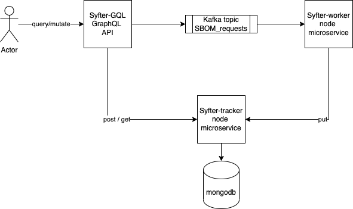

# Cider Assignment

## SBOM Extraction System - syfter

## Architecture

The system is comprised of 3 microservices:

* syfter-gql - a graphql facade that provides API to the system's users
* syfter-worker - a nodejs service that accepts requests (via kafka) and perform the SBOM extraction (by running syft commands)
* syfter-tracker - a nodejs express service that persistantly tracks the SBOM requests and responses.  It uses a mongodb for storage

## Deployment

* Deploy Kafka (I used Strimzi: https://strimzi.io/quickstarts/)
* Set the address of the bootstrap broker in the config map under syfter-config/helm/sytfer-config/templates/configmap.yaml - KAFKA_BROKER_1
* set the mongourl (or use the existing one ) in syfter-tracker/helm/templates/configmap.yaml - MONGODB_URL
* Each service is deployed via helm chart to a k8s cluster.
* Run install.sh to build and install the services

## Consideration points

* interfaces:
  * external:  graphQL - maybe an overkill for this project, but I prefer it as external API
  * internal:  
    * kafka for async & fault tollerant processing
    * REST for internal sync comminication between microservices
* Performance effciency: each worker pod can process messages from multiple partitions in parallel, up to a cap defined by an env variable.
* Horizonal scalability: worker pods can be scaled. up to the number of partitions defined for the topic
* Fault tollerancy: using kafka for storing the requests guarentees that if a message failed to process (because of intermitant issue), it will be reprocessed.  In case of permentant errors (for example wrong image name) the error will be reported in the reply, and it will be the user's responsibility to fix and retry.  other errors that may happen during the synchronous processing of the request (db errors etc) will be reported to the requester immedietly.
  * health checks end point should be added to the services.
* Persistency - I used mongodb to store the requests and responses.
* Observability - As the services are deployed to k8s, we can use k8s tools to monitor them, in addition, the apollo graphQL server can be monitored (performance) from apollo studio.  there are many tools that can be used to monitor kafka, but in real production case I would have added prometheus exporter to report metrics to the worker.
* clean code - I hope :)
